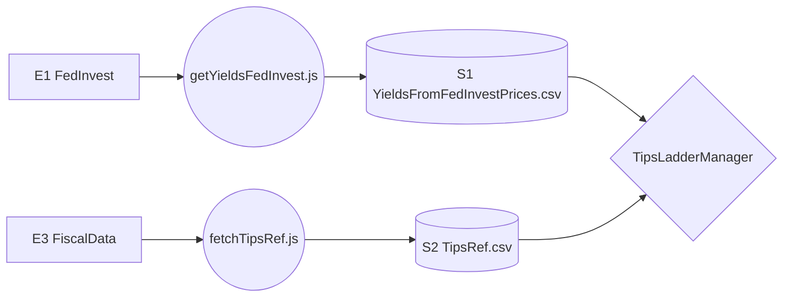

# 3.1 Data Pipeline (TIPS Logic)

## Dependencies
**Requires:** [TIPS Basics](../../knowledge/TIPS_Basics.md)

---

## 1.0 Data Context (DFD)

This diagram shows the flow of TIPS-specific metadata and price data.

---

## 2.0 Ingestion Processes

### [getYieldsFedInvest.js](../../scripts/getYieldsFedInvest.js)
The primary price ingestion job for TipsLadderManager.
- **Frequency**: Daily (Weekdays ~1 PM ET).
- **Logic**: Scrapes the FedInvest daily price table for all TIPS. Cross-references with `TipsRef.csv` to calculate YTM (Excel YIELD convention).
- **Output**: `YieldsFromFedInvestPrices.csv`.

### [fetchTipsRef.js](../../scripts/fetchTipsRef.js)
Fetches immutable TIPS metadata from the FiscalData API.
- **Frequency**: Weekly (or on-demand for new issuances).
- **Logic**: Queries the `auctions_query` endpoint for TIPS with "Original" issuance type.
- **Output**: `TipsRef.csv` (contains Coupon, Dated Date, and Base CPI).

---

## 3.0 Data Elements
*Refer to the [DATA_DICTIONARY.md](../../knowledge/DATA_DICTIONARY.md) for full definitions.*

- **[Yield](../../knowledge/DATA_DICTIONARY.md#yield)**: The real yield-to-maturity (YTM) used for ladder discounting.
- **[Base CPI](../../knowledge/DATA_DICTIONARY.md#ref-cpi)**: The reference CPI on the bond's dated date, used for [Index Ratio](../../knowledge/DATA_DICTIONARY.md#index-ratio) calculations.
