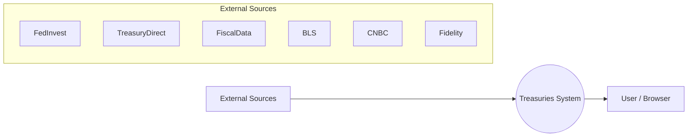
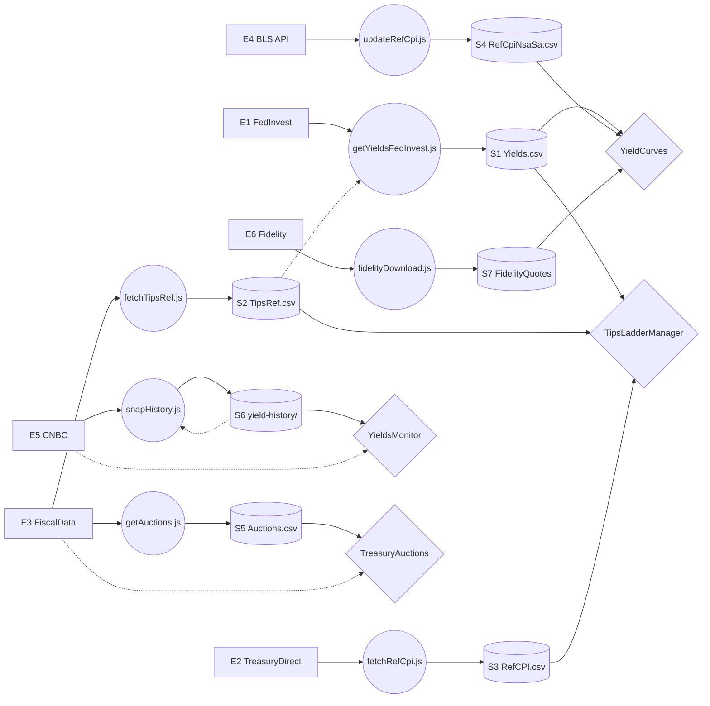

# 0.2 Data Flow Diagram (DFD)

**Scope:** Global — covers all apps and pipelines in the Treasuries repo.
**Authority:** This document is the primary source of truth for the system's data architecture and pipeline logic.

---

## System Context (Level 0)

The system boundary includes GitHub Actions workflows, local automation scripts, and Cloudflare R2 storage.

---

## External Entities (E)
*Refer to [DATA_DICTIONARY.md](./DATA_DICTIONARY.md) for full descriptions.*

| ID | Name | URL | What it provides |
|---|---|---|---|
| **E1** | FedInvest | `treasurydirect.gov` | Daily settlement prices |
| **E2** | TreasuryDirect | `treasurydirect.gov` | Daily RefCPI values |
| **E3** | FiscalData | `api.fiscaldata.treasury.gov` | Auction results & TIPS metadata |
| **E4** | BLS Public API | `api.bls.gov` | NSA/SA CPI-U time series |
| **E5** | CNBC GraphQL | `cnbcfm.com` | Market mid-price yields |
| **E6** | Fidelity | `fixedincome.fidelity.com` | Broker ask/bid quotes |

---

## Data Stores (S)
*Refer to [DATA_DICTIONARY.md](./DATA_DICTIONARY.md) for schemas.*

| ID | R2 Key | Description | Update Frequency |
|---|---|---|---|
| **S1** | `Yields.csv` | Daily Treasury prices & YTM | Weekdays ~1 PM ET |
| **S2** | `TipsRef.csv` | TIPS metadata (Coupons, Dated Dates) | Weekly |
| **S3** | `RefCPI.csv` | Daily interpolated RefCPI | Monthly |
| **S4** | `RefCpiNsaSa.csv` | BLS CPI NSA/SA time series | Daily (on release day) |
| **S5** | `Auctions.csv` | Historical auction results since 1980 | Weekdays |
| **S6** | `yield-history/` | Per-symbol yield time series (JSON) | Weekdays |
| **S7** | `Fidelity*.csv` | Broker market quotes | 3× Daily |

---

## Data Flow Diagram (Level 1)

### Legend

| Shape / Line | Meaning |
|---|---|
| `[Rectangle]` | **External Entity**: Source outside our control (API, Website). |
| `((Circle))` | **Process**: Script or Workflow that transforms or moves data. |
| `[(Cylinder)]` | **Data Store**: R2 Cloud Storage file (CSV/JSON). |
| `{Diamond}` | **Application**: Browser-based tool that consumes the data. |
| `───►` (Solid) | **Primary Flow**: A direct write or read operation. |
| `- - ►` (Dashed) | **Dependency / Fetch**: Secondary lookup or live browser request. |

---

## Internal Processes
*Refer to [DATA_DICTIONARY.md](./DATA_DICTIONARY.md) for variable definitions.*

| Process | Workflow / Script | Reads | Writes |
|---|---|---|---|
| FedInvest yield computation | `get-yields-fedinvest.yml` | E1, S2 | S1 |
| TIPS reference fetch | `fetch-tips-ref.yml` | E3 | S2 |
| Reference CPI fetch | `fetch-ref-cpi.yml` | E2 | S3 |
| CPI NSA/SA update | `update-ref-cpi-nsa-sa.yml` | E4 | S4 |
| Auction results fetch | `get-auctions.yml` | E3 | S5 |
| Yield history snapshot | `update-yield-history.yml` | E5, S6 | S6 |
| Fidelity download/upload | Local automation | E6 | S7 |

---

## [Data Dictionary (DD)](./DATA_DICTIONARY.md)

This document relies on the **[DATA_DICTIONARY.md](./DATA_DICTIONARY.md)** for all specific variable definitions, financial formulas, and technical constants.
