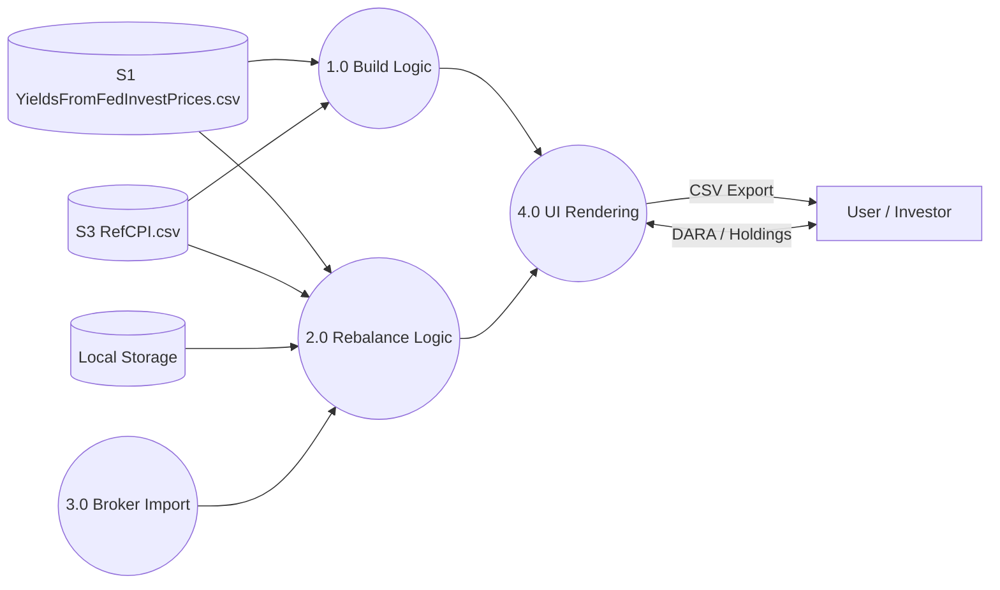

# TipsLadderManager (App Overview)

**TipsLadderManager** is a browser-based tool for designing and rebalancing TIPS (Treasury Inflation-Protected Securities) ladders. It serves as both a practical utility for wealth management and an educational resource for first-principles financial math.

---

## 1.0 App Context (Level 1 DFD)

---

## 2.0 Core Processes

### [1.0 Ladder Construction (Build Mode)](../TipsLadderManager/knowledge/2.0_TIPS_Ladders.md)
The algorithm for building a new ladder from scratch.
- **Inputs**: [DARA](../../knowledge/DATA_DICTIONARY.md#dara), Ladder Period, Current Market Yields.
- **Key Constraints**: Longest-to-shortest construction, [Gap Year](../../knowledge/DATA_DICTIONARY.md#gap-years) handling via [Bracket Years](../../knowledge/DATA_DICTIONARY.md#bracket-year).

### [2.0 Ladder Rebalancing (Rebalance Mode)](../TipsLadderManager/knowledge/3.0_TIPS_Ladder_Rebalancing.md)
The logic for aligning existing holdings to a target.
- **Inputs**: Current Holdings (Manual/Import), [DARA](../../knowledge/DATA_DICTIONARY.md#dara) (Inferred/User), [RefCPI](../../knowledge/DATA_DICTIONARY.md#ref-cpi).
- **Sub-Modes**: Gap-Only (minimal trades) vs. Full (build-from-cash).
- **Technically Precise Algorithm**: [View 3.0 Specs](../TipsLadderManager/knowledge/3.0_TIPS_Ladder_Rebalancing.md).

### [3.0 Broker Data Ingestion](../TipsLadderManager/knowledge/2.1_Broker_Import.md)
Normalizes exported CSV data from brokers (Fidelity, Schwab) into the app's internal holding format.

---

## 3.0 Foundational Logic (The Engine Room)

These documents contain the "bottom-level" technical specifications required to rebuild the app:

- **[Bond Ladder Foundations (1.0)](../TipsLadderManager/knowledge/1.0_Bond_Ladders.md)**: Conceptual groundwork for any ladder (Nominal or TIPS).
- **[Computation Modules (4.0)](../TipsLadderManager/knowledge/4.0_Computation_Modules.md)**: Mathematical functions for PV, Duration, and Accrued Interest.
- **[UI & Schema (5.0)](../TipsLadderManager/knowledge/5.0_UI_Schema.md)**: Data structures for the internal ladder model and DOM mapping.
- **[Bond Math (shared)](../../shared/knowledge/Bond_Basics.md)**: Global financial formulas used across all apps.

---

## 4.0 Data Lifecycle

TipsLadderManager fetches its market context from Cloudflare R2 on every page load.
- **[TIPS Data Pipeline (3.1)](../TipsLadderManager/knowledge/3.1_Data_Pipeline.md)**: Detailed specs for the ingestion of prices and metadata.
- **Source**: `YieldsFromFedInvestPrices.csv` (updated daily ~1 PM ET).
- **Source**: `RefCPI.csv` (updated monthly on BLS release).
- **Persistence**: User holdings are stored in browser `localStorage`.
